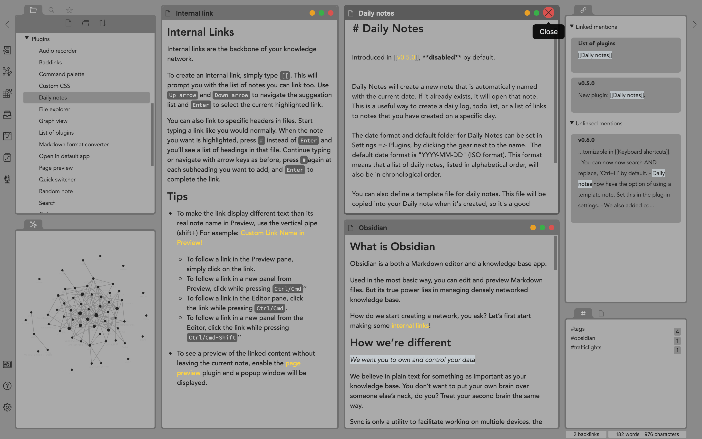
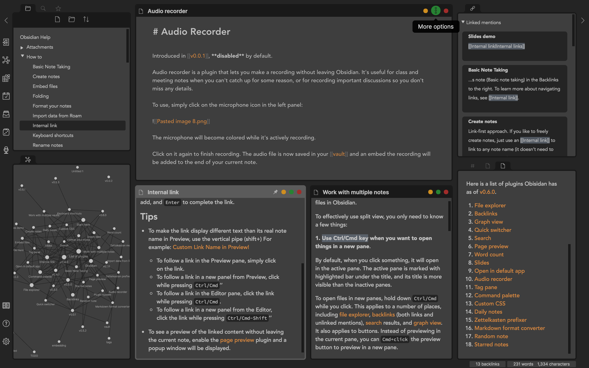
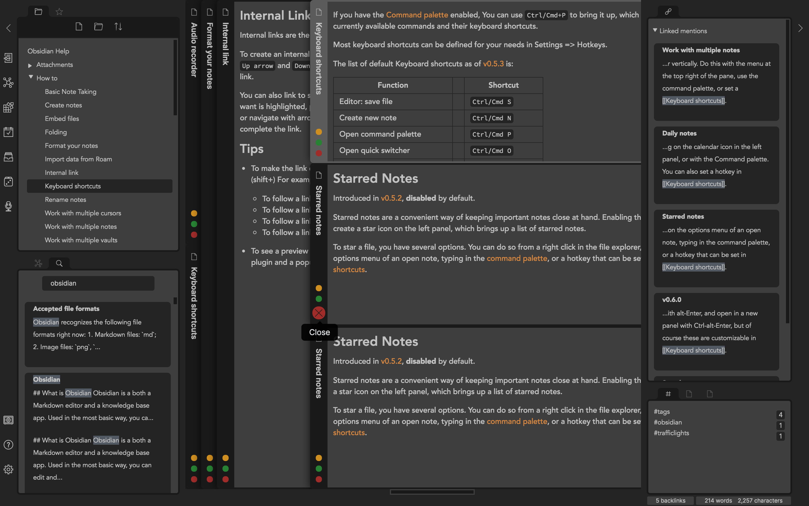

# obsidian-traffic-lights
A dark/light CSS theme for [Obsidian](http://www.obsidian.md).

## Screenshots
#### Light Mode

#### Dark Mode

#### Andy Matuschak Mode
There are some optional 'tweaks' in the last section of the file, which on default are set as comment, but can be enabled simply be removing the corresponding symbols (`/*` and `*/`). That includes, for example, an adapted version of the [Andy Matuschak mode](https://notes.andymatuschak.org/) by [deathau](https://github.com/deathau) (search for `_andy_matuschak_mode` in [obsidian.css](obsidian.css)).

# Install
1. Download [obsidian.css](obsidian.css) to your Obsidian vault folder.
2. In Obsidian, turn on 'Custom CSS' at: `Settings > Appearance > Custom CSS`.
